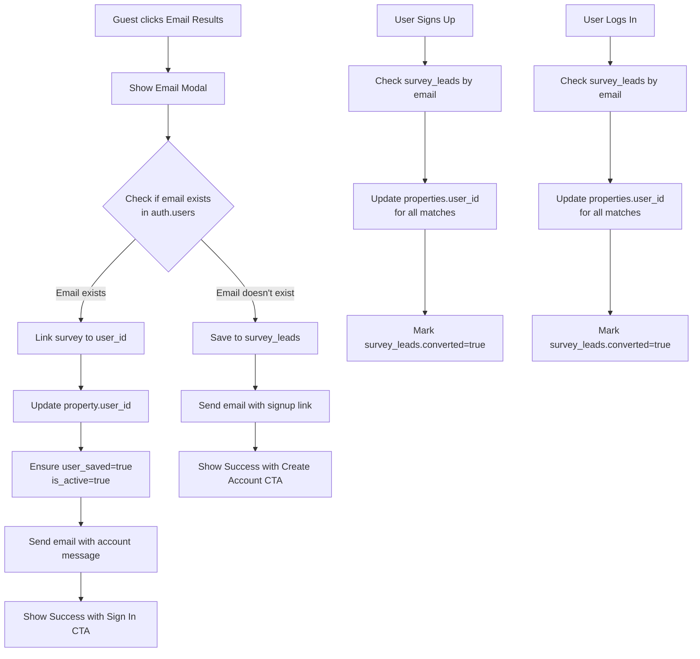

# Guest Email Collection & Survey Merge Implementation

## Overview

Allow non-logged-in users to email their survey results by collecting their email address. If the email matches an existing account, link the survey immediately. Otherwise, save to `survey_leads` for later conversion. Automatically merge guest surveys when users sign up or log in.

## Database Schema

### Create `survey_leads` Table

**File**: New SQL migration or Supabase table creation

- `id` (UUID, Primary Key)
- `email` (String, required)
- `property_id` (UUID, Foreign Key to `properties` table)
- `converted` (Boolean, default `false`)
- `created_at` (Timestamp, auto)
- Index on `email` for fast lookups

## Implementation Flow

## Components to Modify

### 1. Email Modal Component

**File**: `src/components/EmailModal.js` (new)

- Email input field
- Validation (email format)
- Loading state during check
- Error handling
- Different messages based on email existence:
- If exists: "It looks like you already have an account! Sign in to save these results to your profile, or we can send a one-time copy to this email."
- If doesn't exist: Normal email collection flow

### 2. Calculator Page - Email Handler

**File**: `src/app/calculator/page.js`

- Modify `handleEmailPDF` to:
- Show modal for guests (not logged in)
- For logged-in users: Use existing flow (use `user.email`)
- Pass `propertyId` to modal for linking
- Add success state UI after email is sent:
- Success message: "Check your inbox!"
- CTA button: "Create My Account" (for guests) or "Sign In" (if email exists)
- Pre-fill email in signup/login URL

### 3. Email API Route

**File**: `src/app/api/email-pdf/route.js`

- Accept `isGuest` flag
- Accept `propertyId` for guest users
- Before sending email:
- Check if email exists in `auth.users` (via Supabase RPC or direct query)
- If exists:
    - Link survey: Update `properties.user_id` where `id = propertyId`
    - Set `user_saved = true` and `is_active = true`
    - Don't save to `survey_leads`
    - Return `emailExists: true` flag
- If doesn't exist:
    - Save to `survey_leads`: Insert `{ email, property_id: propertyId, converted: false }`
    - Send email normally
    - Return `emailExists: false` flag

### 4. Email Content

**File**: `src/app/api/email-pdf/route.js` (email HTML)

- Modify email template:
- For guests: Include signup link: `yoursite.com/signup?email={email}`
- Message: "You're viewing a guest summary. To unlock the full dashboard and save your history, click here to finish setting up your profile."
- Include survey results PDF attachment

### 5. Signup Flow - Merge Surveys

**File**: `src/app/api/auth/signup/route.js`

- After successful signup:
- Check `survey_leads` table for email matches where `converted = false`
- For each match:
    - Update `properties.user_id` to new user's ID where `id = survey_leads.property_id`
    - Set `user_saved = true` and `is_active = true`
    - Mark `survey_leads.converted = true`
- Return success

**File**: `src/app/signup/page.js`

- After successful signup API call:
- Check if email was pre-filled from URL (`?email=...`)
- If so, the backend merge should have already happened
- Show success message about linked surveys
- Redirect to dashboard

### 6. Login Flow - Merge Surveys

**File**: `src/app/api/auth/login/route.js`

- After successful login:
- Check `survey_leads` table for email matches where `converted = false`
- For each match:
    - Update `properties.user_id` to logged-in user's ID where `id = survey_leads.property_id`
    - Set `user_saved = true` and `is_active = true`
    - Mark `survey_leads.converted = true`
- Return success

**File**: `src/app/login/page.js`

- After successful login API call:
- Check if email was pre-filled from URL (`?email=...`)
- Backend merge should have already happened
- Show success message about linked surveys
- Redirect to dashboard

### 7. Helper Function - Check Email Exists

**File**: `src/app/api/check-email/route.js` (new)

- Endpoint to check if email exists in auth.users
- Returns: `{ exists: boolean, userId?: string }`
- Used by frontend modal before submitting email

### 8. Helper Function - Link Survey to User

**File**: `src/app/api/supabase/route.js`

- Add new action: `linkGuestSurveyToUser`
- Parameters: `propertyId`, `userId`
- Updates `properties` table:
- Set `user_id = userId`
- Set `user_saved = true`
- Set `is_active = true`
- Returns success/error

## Success State UI

### After Email Sent (Guest)

- Replace "Email Me These Results" button area with:
- Success message: "Check your inbox! Your results have been sent."
- CTA button: "Create My Account" → Links to `/signup?email={email}`
- Secondary text: "Want to keep these results forever? Create a free account to track your progress and access more insights."

### After Email Sent (Email Exists)

- Show: "We found an account with this email! Sign in to save these results to your profile."
- Button: "Sign In" → Links to `/login?email={email}&next=/calculator`

## Error Handling

- If email check fails: Show error, allow retry
- If linking fails: Log error, still send email, show warning
- If survey_leads insert fails: Log error, still send email
- Network errors: Show user-friendly message

## Testing Considerations

- Test with existing user email
- Test with new email (should save to survey_leads)
- Test signup flow with pre-filled email
- Test login flow with pre-filled email
- Test multiple surveys for same email
- Verify surveys appear on dashboard after merge